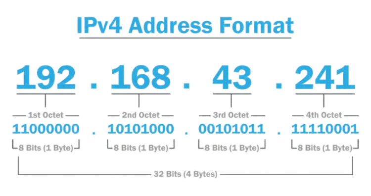

# Direccionamiento IP

Una **dirección IP** es una etiqueta numérica que identifica de manera lógica y jerárquica a una interfaz —habitualmente un dispositivo de computadora, laptop, teléfono inteligente conectada a la red, que utilice el protocolo de internet o que corresponda al nivel de red del modelo TCP/IP.​ En principio se usa en la red global, aunque también para aplicaciones locales (como la identificación de un rúter en una red cerrada). Una dirección IP tiene dos funciones principales: identificación de la interfaz de red y direccionamiento para su ubicación.

---

## IPv4

**IPv4** es el nombre del protocolo de Internet utilizado actualmente para las direcciones IP de los dominios. Estas direcciones IP se asignan automáticamente cuando se registra un dominio.

Una dirección IPv4 tiene el formato: 192.168.1.25

Consta de **32 bits** divididos en 4 bloques.

---

## Clases de IPv4

- **Clase A:** 1.0.0.0 – 126.0.0.0  
- **Clase B:** 128.0.0.0 – 191.255.0.0  
- **Clase C:** 192.0.0.0 – 223.255.255.0  

---

## Máscara de red

Sirve para dividir la red en:

- parte de red  
- parte de host  

Ejemplo:
Dirección: 192.168.1.20
Máscara: 255.255.255.0 (/24)

---

## Subredes

Permiten dividir una red grande en redes más pequeñas.

Ejemplo con /26:
Subred 1: 192.168.1.0 - 192.168.1.63
Subred 2: 192.168.1.64 - 192.168.1.127

---

!!!warning "¡Importante!"
    El direccionamiento IP es esencial para que los dispositivos se comuniquen correctamente.

